# techChallenge FIAP - G24 FASE 2

API desenvolvida para controle de pedidos de uma lanchonete utilizando Kubernetes e refatoração do código seguindo padrões clean code.


- Miro: [Dashboard Miro](https://miro.com/app/board/uXjVKQl5ank=/?share_link_id=2259608060)
- Vídeo: https://www.youtube.com/watch?v=9si3VwYQDNg


## Grupo 24 - Integrantes
💻 *<b>RM355456</b>*: Franciele de Jesus Zanella Ataulo </br>
💻 *<b>RM355476</b>*: Bruno Luis Begliomini Ataulo </br>
💻 *<b>RM355921</b>*: Cesar Pereira Moroni </br>


## Nome Discord:
Franciele RM 355456</br>
Bruno - RM355476</br>
Cesar P Moroni RM355921</br>

## Desenho da arquitetura

Desenho com detalhes da infraestrutura do software

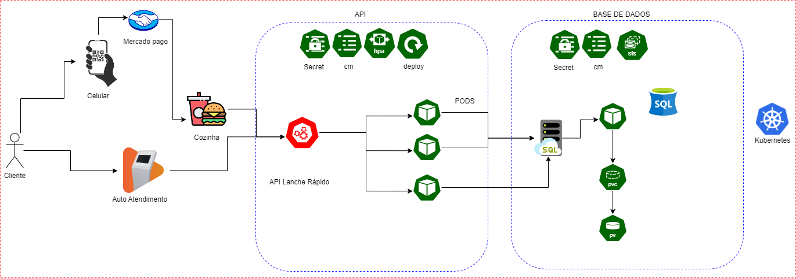


Execute o Docker Engine.

Abra um terminal e execute o comando iniciar o minikube:


```
minikube start

```


Também no terminal, acesse a pasta kubernetes no arquivo cmd_init.txt dentro do projeto e execute os comandos:

```
kubectl apply -f database-configMap.yaml
kubectl apply -f database-pv.yaml
kubectl apply -f database-pvc.yaml
kubectl apply -f database-secrets.yaml
kubectl apply -f database-service.yaml
kubectl apply -f database-deployment.yaml
kubectl apply -f app-configmap.yaml
kubectl apply -f app-deployment.yaml
kubectl apply -f app-hpa.yaml
kubectl apply -f app-secrets.yaml
kubectl apply -f app-service.yaml
kubectl apply -f adminer-deployment.yaml
kubectl apply -f adminer-service.yaml

```


Execute o comando a seguir para visualizar os recursos criados no ambiente Kubernetes:


```
minikube dashboard

```


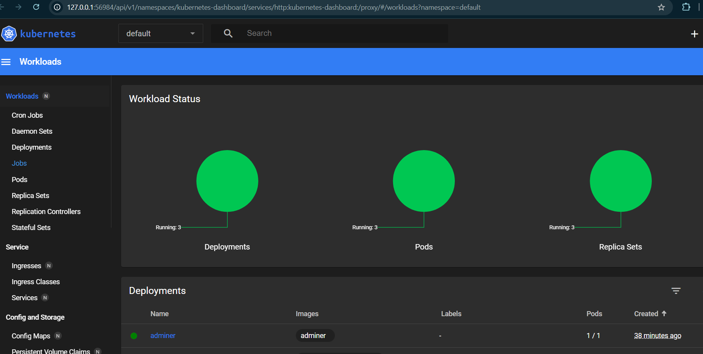


Abra o terminal na pasta kubernetes e execute o comando abaixo para expor o Adminer na porta 8090:


```

kubectl port-forward svc/adminer 8090:8080

```

Acesse o Adminer no browser: http://localhost:8090/

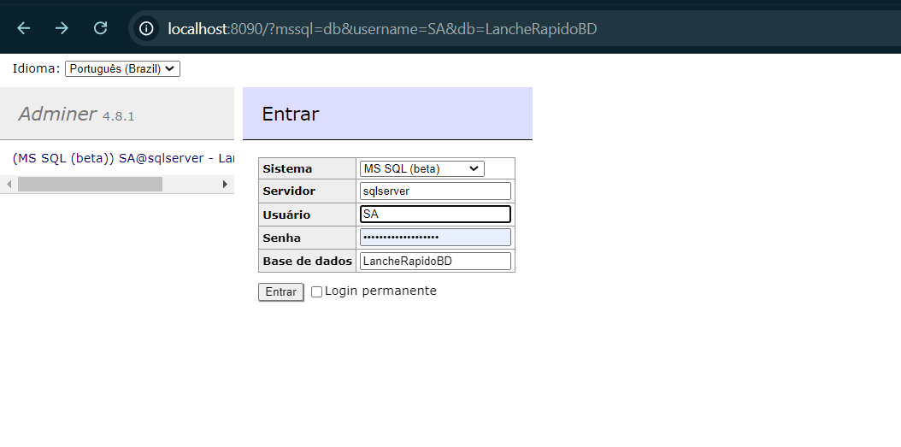


```
Servidor: sqlserver
Usuário: SA
Senha: YourStrong!Passw0rd
Base de Dados: LancheRapidoBD

```
Importe o arquivo scriptInserts.sql que esta na pasta API e clique em executar.

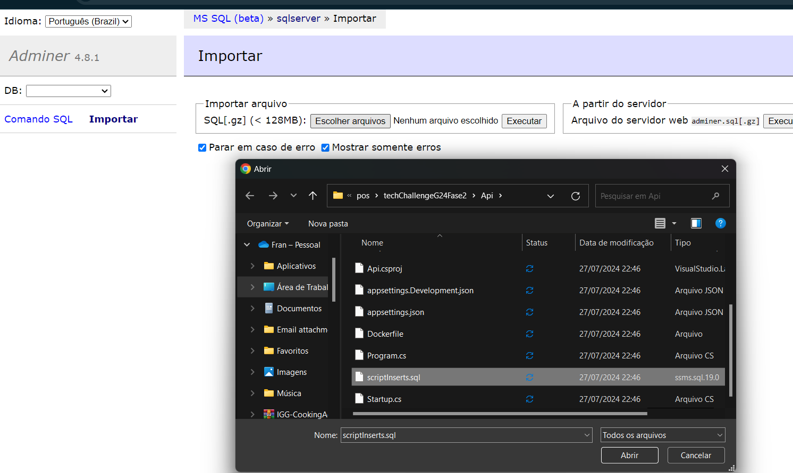
 
</br>
<b>Como acessar a API</b>:
</br>


Abra outro terminal e execute o comando

```
kubectl port-forward svc/app 8080:80

```
 
<b>API</b>: http://localhost:8080/swagger/index.html
</br>

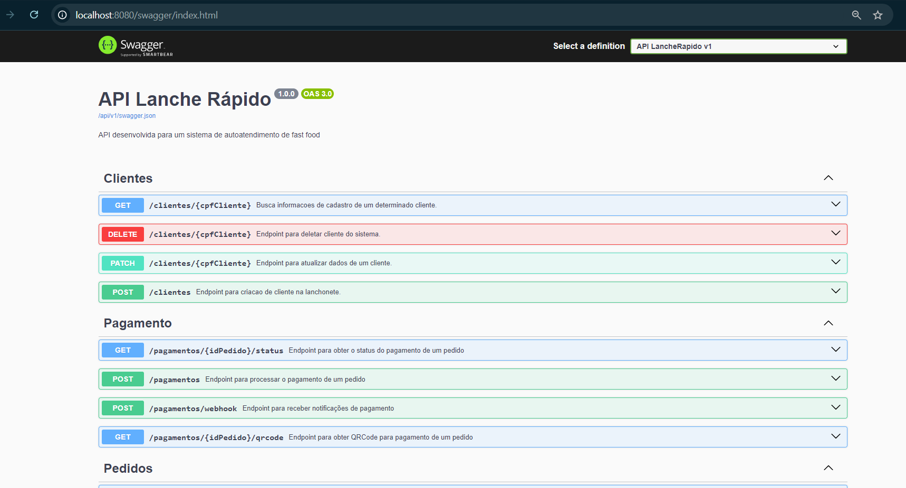


No endpoint GET/pedidos, já existe alguns pedidos criados para testes</br>
Liste todos os pedidos realizadose escolha um idPedido com o status RECEBIDO.


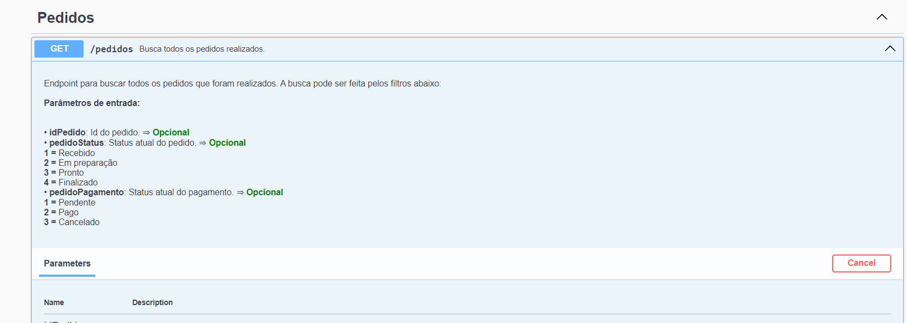</br>
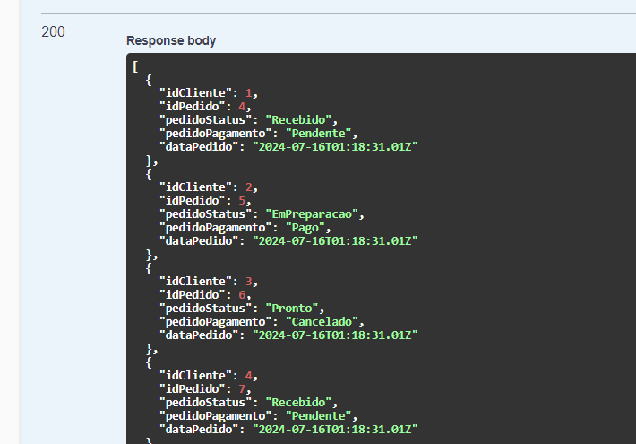


## Obtenha o QRCode para pagamento do pedido no Mercado Pago.

Crie um pagamento para um pedido que esteja com o status RECEBIDO.
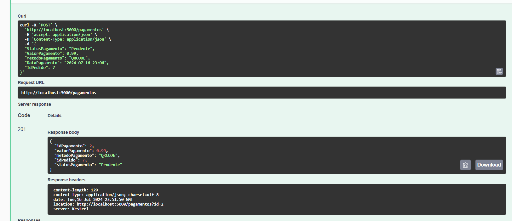


Obtenha o QRCode para pagamento do pedido no Mercado Pago.

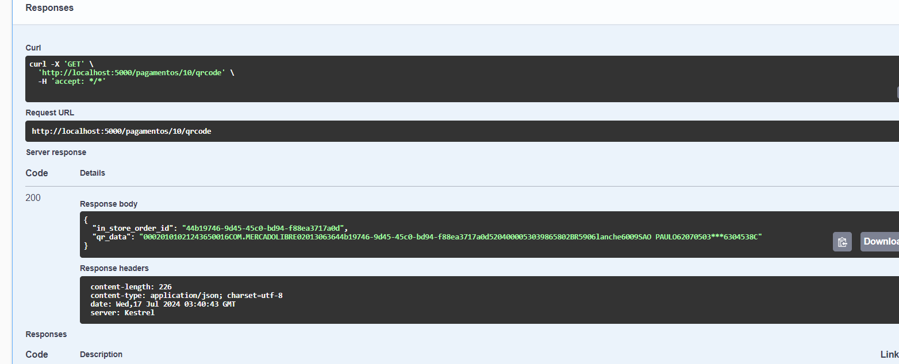

Acesse o site https://www.qrcode-monkey.com/ e gere a imagem utilizando o QR Code obtido no campo qr_data. Na página, selecione a aba TEXT, cole o QR Code no campo Your Text e clique no botão Create QR Code para criar a imagem correspondente.


Ao ler  o qrCode no app do mercado pago

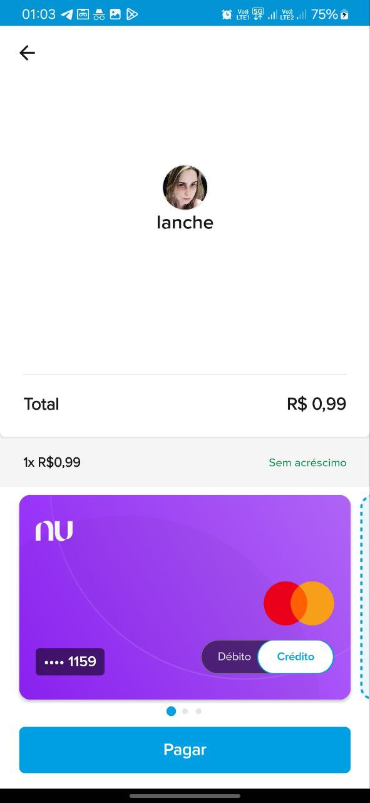</br>

Concluindo o pagamento
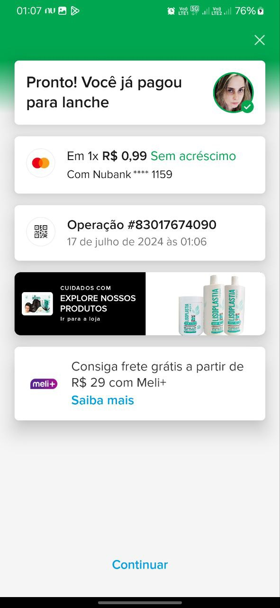</br>
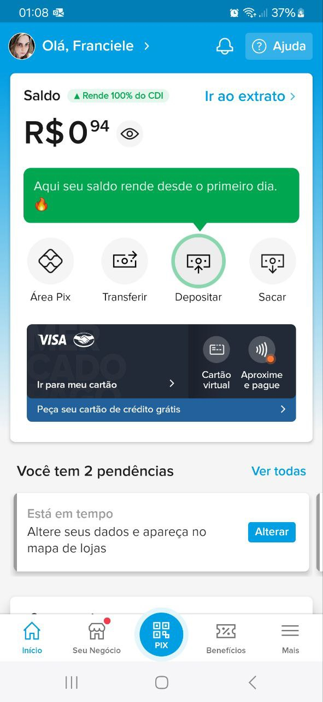


Verifique a notificação recebida no Webhook.site e copie o id da merchant_order.

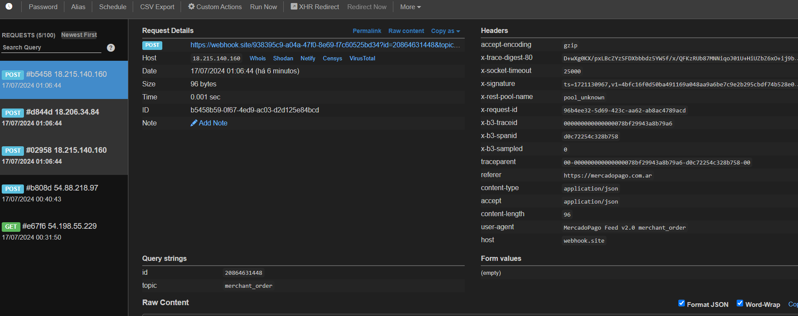</br>
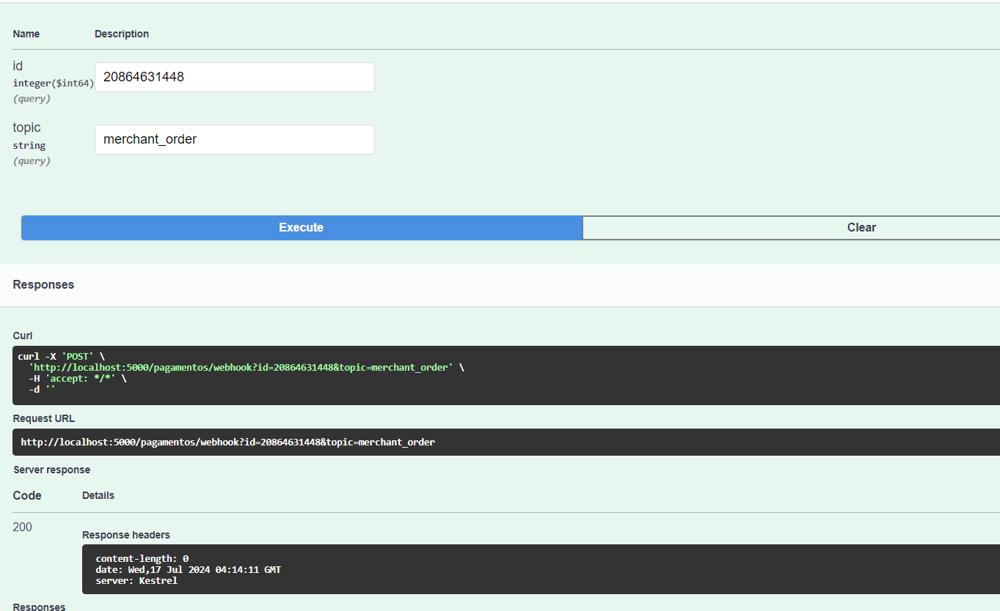

Verifique novamente o status do pagamento do pedido como Aprovado.

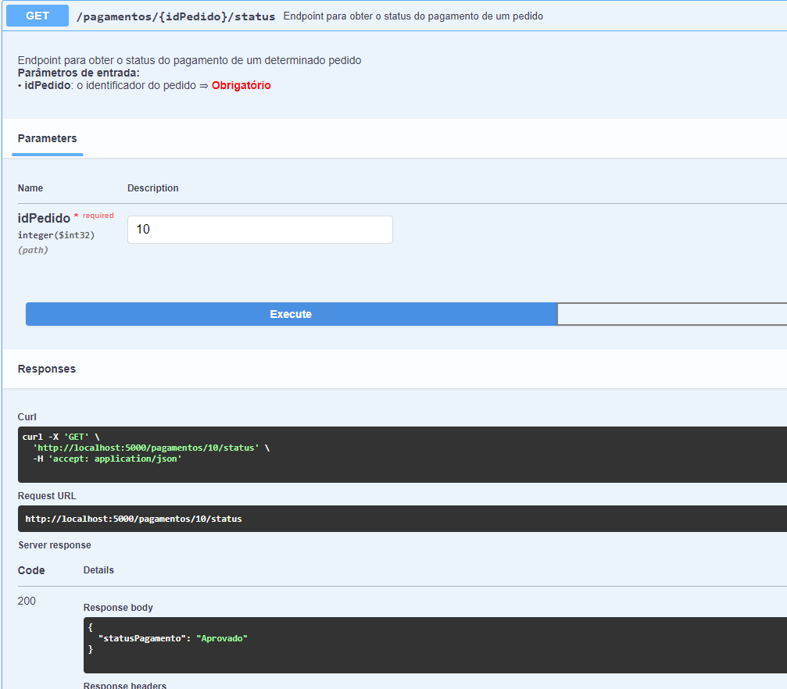

</br>
</br>


